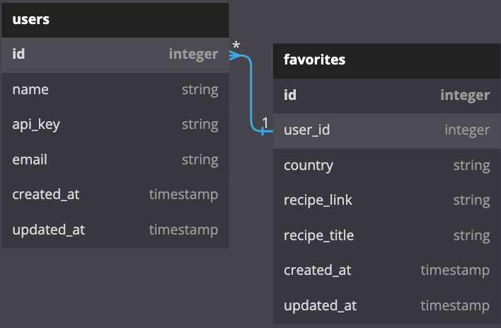
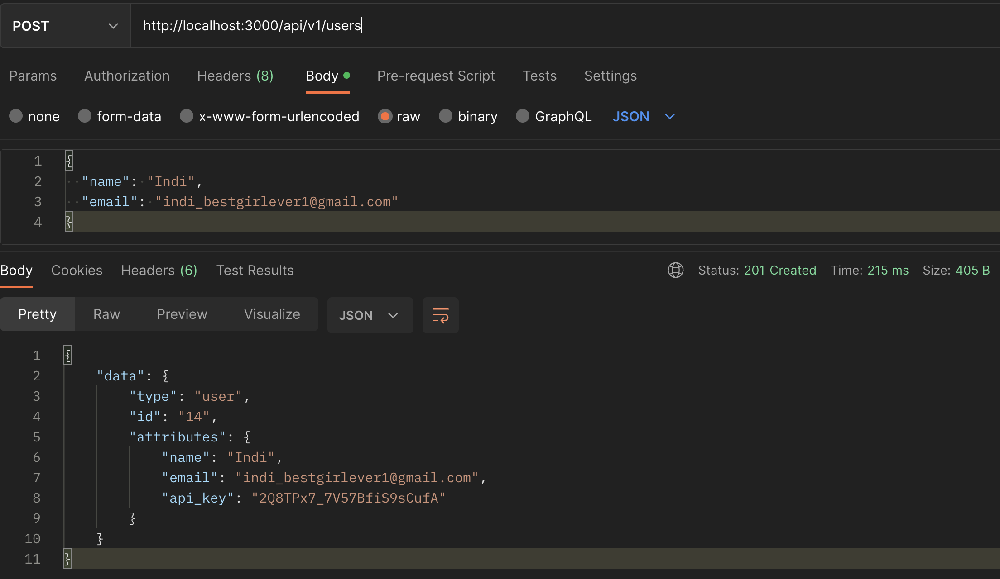
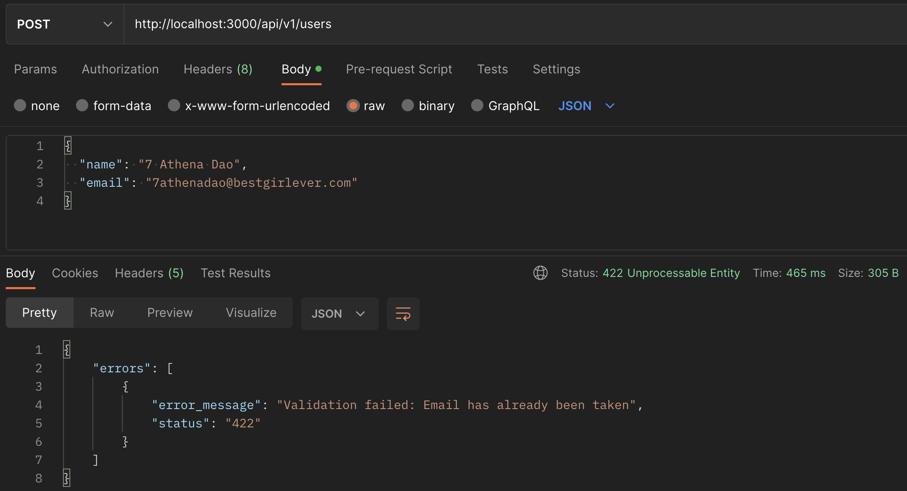
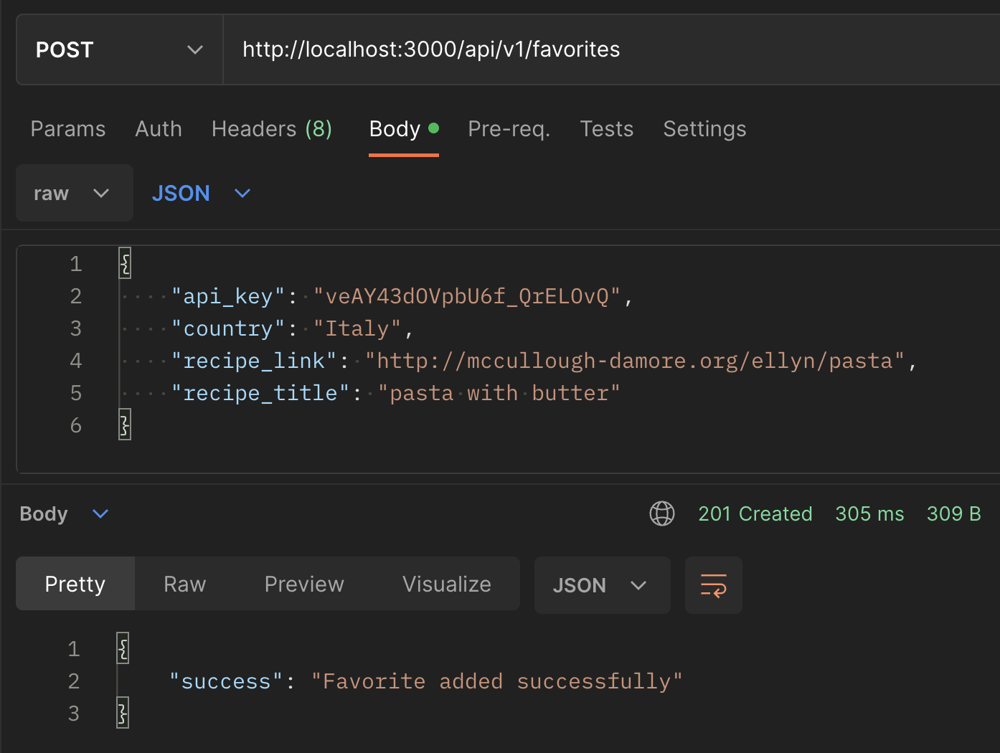
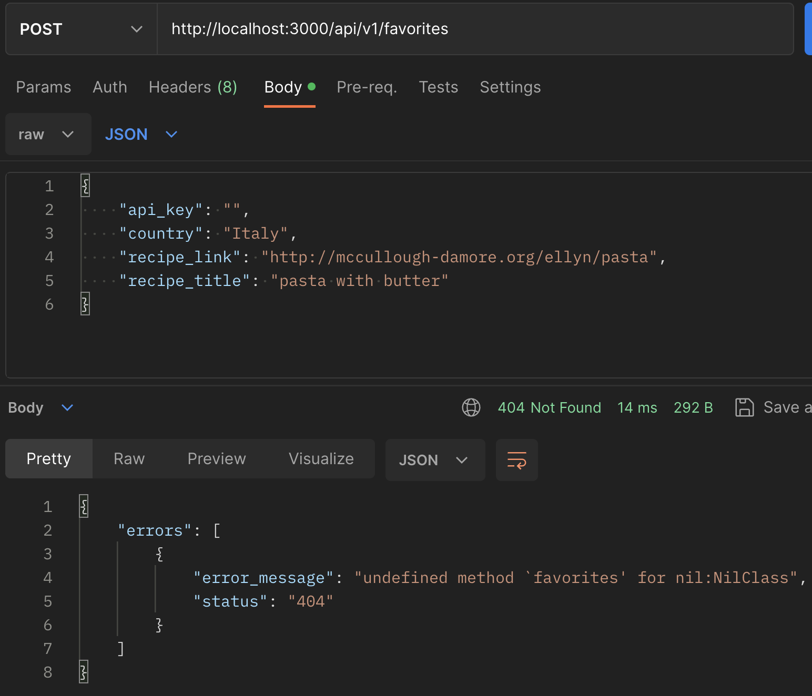
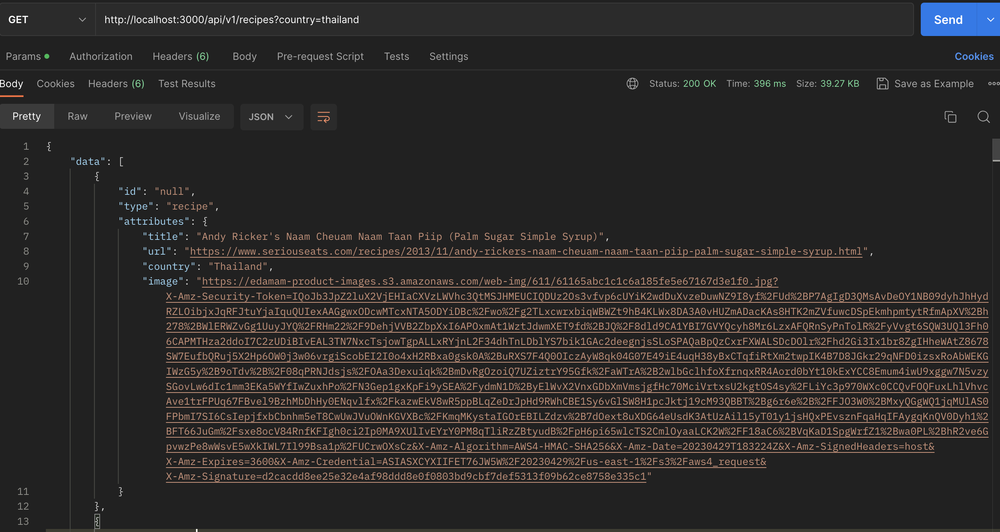
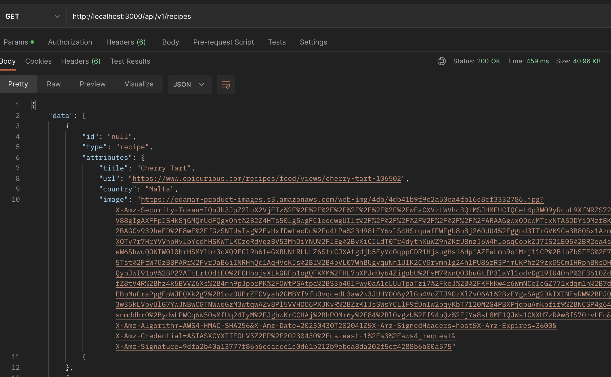
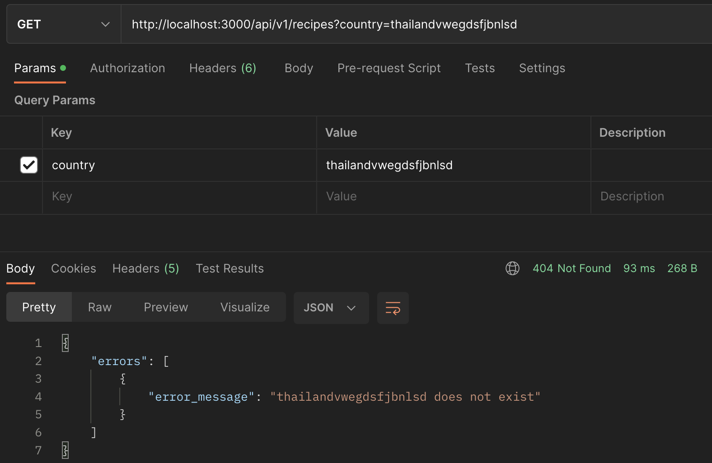
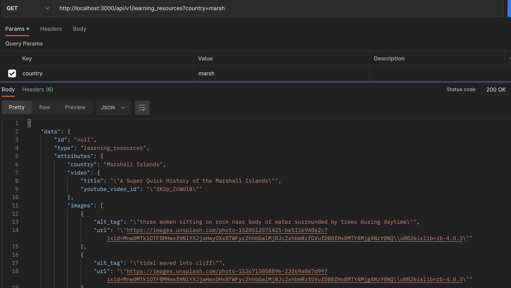
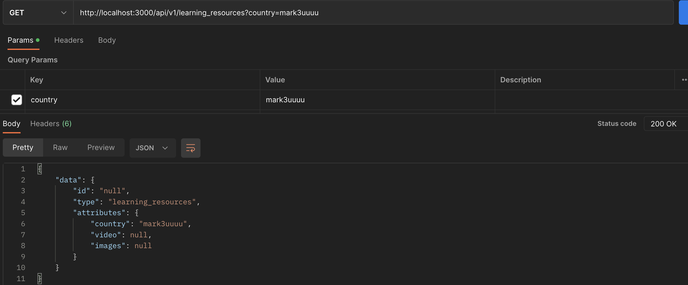

<br>
<details>
  <summary>Lunch and Learn Table of Contents</summary>
  <ul list-style-position="inside">
    <li>
      <a href="#lunch-and-learn-app-overview">Lunch and Learn App Overview</a>
      <ul>
        <li><a href="#learning-goals">Learning Goals</a></li>
        <li><a href="#apis-consumed">APIs Consumed</a></li>
        <li><a href="#schema">Schema</a></li>
      </ul>
    </li>
    <li>
      <a href="#specs-and-deployment-instructions">Specs and Deployment instructions</a>
      <ul>
        <li><a href="#prerequisites">Prerequisites</a></li>
        <li><a href="#installation">Installation</a></li>
      </ul>
    </li>
    <li>
      <a href="#usage">Usage</a>
      <ul>
        <li><a href="#endpoints">Endpoints</a></li>
      </ul>
    </li>
  </ul>
</details>

<!-- LUNCH AND LEARN APP OVERVIEW -->
## Lunch and Learn App Overview
The overarching goal of the project is to allow users to explore cuisines through a simple country search, save their favorite recipes for later, and provide educational material related to the cuisine's country. 

The project is designed using Service Oriented Architecture, with this app serving as the backend service.

### Learning Goals
<ul>
  <li>Expose an API that aggregates data from multiple external APIs</li>
  <li>Expose an API that requires an authentication token</li>
  <li>Expose an API for CRUD functionality</li>
  <li>Test, both, API consumption and exposure using a mocking tool (Webmock)</li>
</ul>

### APIs Consumes
<ul>
  <li>country input is varified by using Restcountries</li>
  <li>recipes from Edamam</li>
  <li>videos providing a brief history of the country from Youtube</li>
  <li>popular photo images of the country from Unsplash</li>
</ul>

### Schema
Users: A users must have a unique email address. We create an API key for each user. Users can have many favorite recipes. 

Favorites: we store the title, url, and the country that relates to the recipes.  



<!-- SPECS AND DEPLOYMENT INSTRUCTIONS -->
## Specs and Deployment instructions
Ruby & Rails version:
  ```
  Ruby '2.7.4'
  Rails 5.2.8.1
  ```

To run the app locally run the following 4 commands in your termianl :
1. Clone the app to your local pc: $ ```git clone git@github.com:Sergio-Azcona/lunch_and_learn_BE.git```
2. Set up the Gems & dependencies:  $ ```bundle install```
3. Database creation: $ ```rails db:{drop,create,migrage,seed}```
4. Run the server on localhost:3000: $ ```rails s```

Additionally, you can now run the test suite: $ ```bundle exec rspec spec```

## Endpoints

<details close>
  <summary><strong>Creating Users and Favorites</strong></summary>
  <details>
    <summary><strong>Users</strong></summary>
      Creating a user:
      <ul style="list-style-type: none">
        <li>Users require a name and unique email address</li>
        <li>API Endpoint: <i>http://localhost:3000/api/v1/users </i></li>
      </ul>
      Request/Response:
      <ul style="list-style-type: none">
      <li>Happy Path - User is SUCCESSFULLY created</li>
      
      <li>Sad Path - User was NOT created</li>
      
      </ul>
  </details>
  <details>
    <summary><strong>Favorites</strong></summary>
      Creating a favorite:
      <ul style="list-style-type: none">
        <li>data required: recipe title, recipe url, country and user's api key</li>
        <li>API Endpoint: <i>http://localhost:3000/api/v1/favorites</i></li>
      </ul>
      Request/Response:
      <ul style="list-style-type: none">
      <li>Happy Path - favorite is SUCCESSFULLY created</li>
      
      <li>Sad Path - favorite was NOT created</li>
      
      </ul>
  </details>
</details>

<details close>
 <summary><strong>Recipes, Learning Resources, and User Favorites </strong></summary>
  <br>
  <details>
  <summary><strong>Recipes</strong></summary>
      <strong>Happy Paths</strong> noted below - 
      Recipes can be search by country or by letting the app select a country for them. <br>
      <ul>
        <li>Searching by country: pass a country name as a query param to the endpoint<br> 
        <i>http://localhost:3000/api/v1/recipes?country=country_name</i></li>
        <li>example: search results for thailand: <br> 
        <i>http://localhost:3000/api/v1/recipes?country=thailand</i></li>
        
        <li>Random Searching: no country is passed in the query parms; endpoint<br> 
        <i>http://localhost:3000/api/v1/recipes</i></li>
         
       <li>Random Searching: no country is passed in the query parms; endpoint<br> 
      </ul>
      <hr>
      <ul>
      <strong>Sad Paths</strong>:
        <li>Response when a country name is invalid:</li> 
        
       <li>Note: in the event that no recipes exest, an empty data array is returned </li> 
      </ul>
  </details>
  
  <br>
  <details>
  <summary><strong>Learning Resources</strong></summary>
  <ul>
    <strong>Happy Paths</strong>:
      <li>Searching by country: pass a country name as a query param to the endpoint (name can partial or full)<br> 
      <i>http://localhost:3000/api/v1/learning_resources?country=country_name</i></li>
      <li>example: search results for marsh, which returns responses for Marshall Islands: <br> 
      <i>http://localhost:3000/api/v1/learning_resources?country=marsh</i></li>
      
      <hr>
      <strong>Sad Paths</strong>:
      <li>Response when a country name is invalid:</li> 
      
    </ul>
  </details>

</details>